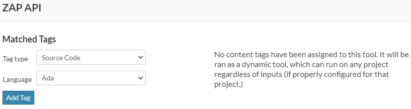

# Code Dx Add-In Tools

New Code Dx deployments will include all available Code Dx Add-Ins. You can update existing Code Dx instances by registering Add-Ins using the configuration details in the sections below.

For details on creating your own Code Dx Add-Ins, refer to the "Walkthrough: Add Tool" section of the [Tool Orchestration](https://community.synopsys.com/s/document-item?bundleId=codedx&topicId=user_guide%2FAnalysis%2Ftool-orchestration.html&_LANG=enus) documentation.

## Black Duck (.NET Core)

The TOML for this Add-In is located [here](./build/blackduck-dotnet/blackduck-dotnet-example.toml).

.PNG)

# Black Duck (Go)

The TOML for this Add-In is located [here](./build/blackduck-go/blackduck-go-example.toml).

.PNG)

# Black Duck (sbt)

The TOML for this Add-In is located [here](./build/blackduck-sbt-java8/blackduck-sbt-example.toml).

.PNG)

# Burp Suite

The TOML for this Add-In is located [here](./build/burpsuite/burpsuite-example.toml).

# Checkmarx

The TOML for this Add-In is located [here](./build/checkmarx/checkmarx-example.toml).

# Coverity (.NET Core)

The TOML for this Add-In is located [here](./build/coverity-dotnet/Coverity-dotnet-example.toml).

.PNG)

>Note: To use this add-in, you must derive a new Docker image with a licensed copy of Coverity. Refer to [specialize.ps1](https://github.com/codedx/codedx-add-ins/blob/main/build/coverity/specialize.ps1) for details on how to build your own Docker image.

# Coverity (Go)

The TOML for this Add-In is located [here](./build/coverity-go/Coverity-go-example.toml).

.PNG)

>Note: To use this add-in, you must derive a new Docker image with a licensed copy of Coverity. Refer to [specialize.ps1](https://github.com/codedx/codedx-add-ins/blob/main/build/coverity/specialize.ps1) for details on how to build your own Docker image.

# Coverity (sbt)

The TOML for this Add-In is located [here](./build/coverity-sbt-java8/Coverity-sbt-example.toml).

.PNG)

>Note: To use this add-in, you must derive a new Docker image with a licensed copy of Coverity. Refer to [specialize.ps1](https://github.com/codedx/codedx-add-ins/blob/main/build/coverity/specialize.ps1) for details on how to build your own Docker image.

# ErrCheck

The TOML for this Add-In is located [here](./build/golangci-lint/golangci-lint-errorcheck-example.toml).

# Go Vet

The TOML for this Add-In is located [here](./build/govet/govet-example.toml).

# GoLint

The TOML for this Add-In is located [here](./build/golangci-lint/golangci-lint-golint-example.toml).

# GoSec

The TOML for this Add-In is located [here](./build/gosec/gosec-example.toml).

# Ineffassign

The TOML for this Add-In is located [here](./build/golangci-lint/golangci-lint-ineffassign-example.toml).

# Security Code Scan

The TOML for this Add-In is located [here](./build/securitycodescan/SecurityCodeScan-example.toml).

# Staticcheck

The TOML for this Add-In is located [here](./build/staticcheck/staticcheck-example.toml).

# ZAP

The TOML for this Add-In is located [here](./build/zap/zap-example.toml).

# ZAP API

The TOML for this Add-In is located [here](./build/zap/zap-api-scan-example.toml).

